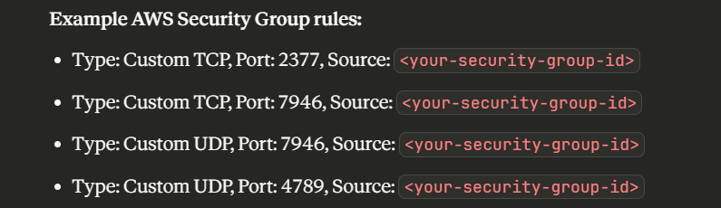
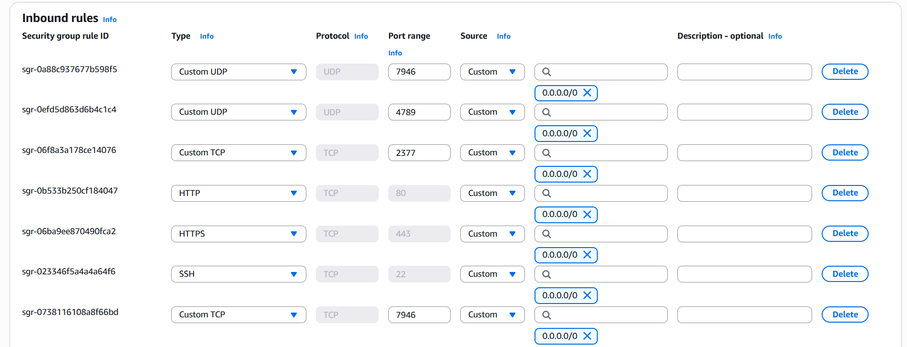

```bash
# vm-test-1
ssh -i "~/.ssh/ekomobong.pem" ubuntu@ec2-98-88-36-29.compute-1.amazonaws.com

98.88.36.29

# vm-test-2
ssh -i "~/.ssh/ekomobong.pem" ubuntu@ec2-35-175-184-252.compute-1.amazonaws.com

35.175.184.252

# vm-test-3
ssh -i "~/.ssh/ekomobong.pem" ubuntu@ec2-54-221-185-165.compute-1.amazonaws.com

54.221.185.165
```

```bash
# Create Swarm (vm-test-1)
docker swarm init --advertise-addr 98.88.36.29
# Make sure to enable port `2377` in the inbound rules.
```

```bash
# join swarm (vm-test-2 & vm-test-3)
docker swarm join --token SWMTKN-1-35ginj4xb66mzm76605lbdvgmtnwcryd0girghhw9qsi3dyi1u-2p32zqbkmnu3commu7gkpofkp 98.88.36.29:2377
```

```bash
# List all nodes (vm-test-1)
docker node ls
```

Ensure to allow the following ports on all nodes:



```bash
# Promote the other nodes (so they can be reachable or backup leaders when the leader goes down)
docker node promote [hostname]
```

```bash
# Create a service (vm-test-1)
docker service create --name nginx-server-1 --publish 8081:80 --replicas 2 nginx:latest

# To remove the service
docker service rm nginx-server-1

# To list services
docker service ls

# To see where the service is running
docker service ps nginx-server-1
```

```bash
# Update a service
docker service update --image nginx:1.29.1 nginx-server-1

# Rollback a service to the previous image
docker service rollback nginx-server-1
```

```bash
# Create compose file (compose.yaml)

# Deploy a new stack using compose file
docker stack deploy -c compose.yaml nginx-server-2
```

```bash
# List stacks
docker stack ls

# See where the stack is runnning
docker stack ps nginx-server-2
```

https://chatgpt.com/c/68fa2c06-7784-832b-b2cd-678ae4f8a70a
https://youtu.be/_YsPt7dIvqU?si=5Gk5G7Ywd31xlOXJ&t=893
